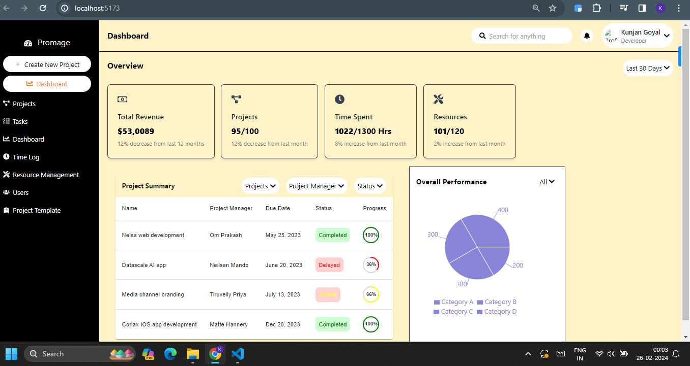

# Project Management Dashboard

## Overview

This project is a web-based frontend dashboard for project management, providing users with a comprehensive overview of their projects, tasks, and team resources.

## Technologies Used

- **React.js**: Frontend framework for building dynamic user interfaces.
- **Material-UI**: React component library for UI design and development.
- **Chart.js**: JavaScript charting library for data visualization.
- **Recharts**: React charting library for creating responsive charts and graphs.
- **React Router**: Library for declarative routing in React applications.

